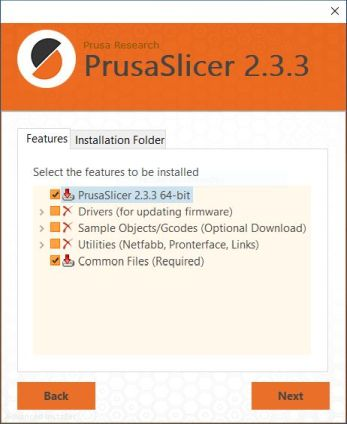
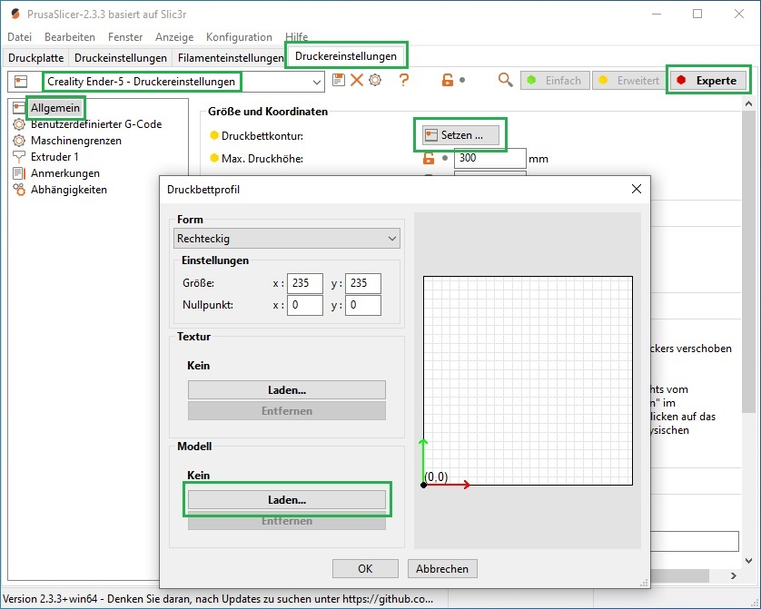

# PrusaSlicer
## **Software**
Beschrieben wird der Download, die Installation und die darauffolgende Konfiguration des PrusaSlicer's.

Zum Zeitpunkt dieser Dokumentation wird der PrusaSlicer und die Konfiguration in folgenden Versionen genutzt:

| Datei | Version | Link |
| :--- | ---: | :-: |
| PrusaSlicer | **2.3.3** | [GitHub UnusedSpace](./sources/) |
| Konfigurationssammlung | **\<NEUESTE>** | [GitHub UnusedSpace](./configs/) |
 

## Software - Download | Installation | Konfiguration

    
<b><i> Download </i></b>

Der PrusaSlicer kann als Standalone (ohne Treiber/Firmware der PrusaPrinter) in aktueller Version über die offizielle [Webseite](https://www.prusa3d.com/page/prusaslicer_424/) herunter geladen werden. Die in dieser Dokumentation verwendete Version und geprüfte Konfigurationssammlungen sind unter oben angegebene Links erreichbar.

    
<b><i> Installation </i></b>

Die Installation verläuft ohne besondere Konfigurationen. Sollte eine neuere Version des PrusaSlicer verfügbar sein, wird ein Download angeboten. Die Version 2.3.3 wurde erfolgreich auf Funktion geprüft. Die Benutzung anderer Releases erfolgen auf eigene Funktionsprüfung.
 

Trotz der *Standalone*-Definition können die vordefinierten Haken im Reiter ***Features*** unter ***Drivers*** und ***Utilities*** entfernt werden.

    
<b><i> Konfiguration </i></b>

Nach dem ersten Start von PrusaSlicer kann der Wizard abgebrochen und eine Konfiguration geladen werden:

> <c> *Import* </c>
> * `Datei > Import > Importiere Konfigurationssammlung...`

> <c> *Export* </c>
> * `Datei > Export > Konfigurationssammlung exportieren...`

    
<b><i> Druckbettkontur - Optional </i></b>

Optional kann eine Druckbettkontur `*.stl` konfiguriert werden, welche im Ordner der Konfigurationssammlungen für den jeweiligen Drucker bereit liegt. Um eine fehlerfreie Funktion von PrusaSlicer sicher zu stellen, sollten die Darstellungsdateien unter dem PrusaSlicer eigenen Konfigurationspfad `%AppData%\PrusaSlicer` abgelegt werden.

 

 

> <u>Achtung</u>
>
> Konfigurierte Druckbettkonturen werden bei einem Export der Konfigurationssammlung lediglich verlinkt! Die Kontur `.stl` selbst wird <u>nicht</u> exportiert. Bei einem Import einer Konfigurationssammlung mit verlinkter Druckbettkontur müssen die `.stl` Dateien vorher in den Ordner `%AppData%\PrusaSlicer` abgelegt werden, anderweitig wird eine Fehlermeldung angezeigt.
>
> Sollte die `.stl` nicht wiederherstellbar sein, kann die Verknüpfung in der `xxxx-xx-xx PrusaSlicer_config_bundle.ini` in der Zeile `bed_custom_model = C:\\Users\\[...]\\Druckplatte_Ender-5.stl` aufgelöst werden, indem der Pfad hinter der Option entfernt wird.
> 
 

**Die Druckbettkontur für den jeweiligen Drucker zuweisen:**
1. Reiter `Druckereinstellungen`
2. Drucker auswählen, beispielsweise `Creality Ender-5 - Druckereinstellungen`
3. Einstellungssammlung `Allgemein`
4. Ansicht mindestens auf `Erweitert`
5. Im Feld `Größe und Koordinaten` bei `Druckbettkontur:` auf `Setzen ...`
6. Im Feld `Modell` auf `Laden...` und die passende Druckbettkontur laden
7. Jeweils mit `Öffnen` und `OK` bestätigen
  

